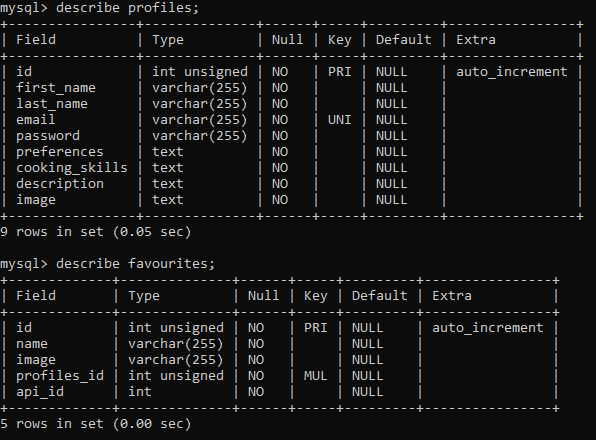

# MVP: Nutrilitious App

Nutrilitous is a web app where users can find delicious recipes based on the ingredients in their fridge. They can create a profile to benefit from additional features, such as saving favourite recipes and querying an OpenAI assistant for inspirational recipes that are based on their own preferences.

## Description

This README file provides an overview of the project, its features, installation instructions, and usage guidelines.

For this project, 4 CodeOP students (Carli, Irene, Saira, and Steph) worked together in the course of about 2 1/5 weeks to create the Nutrilitious MVP.

(`The intention behind this idea was to create a web app that..... because....`) (Carli)

These are the pages: the splash page, `Home`, `About`, `Register`, `Login`, and `Profile`.

## Database

The necessary database for this website consists of two tables (`profiles` & `favourites`) with the following strcuture/columns:

## Features, Pages, and Usage

### Navbar:

`add details here` (Saira)

### Register

`add details here` (Saira)

### Login:

1. The Login component is a user authentication module built with React on the frontend and Express on the backend. The features of the Login component include: 
- Secure user login/logout functionality with JWT authentication;
- Password hashing and salt for enhanced security;
- Customisable error handling.
2. The user login endpoint on the backend is `POST /api/auth/login`.

### Search bar:

`add details here also incl. Spoonacular and recipe card info incl. favourites feature` (Steph)

### Profile:

1. The Profile component is a customizable and secure module built with React on the frontend and Express on the backend. It displays authenticated user data and enables the users to manage their profiles. The main features include:
- Viewing profile information;
- Uploading and updating a profile image;
- Editing profile details provided during registration;
- Displaying a list of favorite recipes.
2. The user profile endpoint on the backend is `GET /api/auth/profile`.

#### Suggestions by OpenAI assistant:

1. The Recipe Assistant component is an interactive chatbot powered by the OpenAI's ChatGPT 3.5 turbo model, that is rendered below the user's profile. The bot has access to the user's cooking and eating preferences obtained from their profile. It uses this information to generate personalized recipes for the user. In case if the user has no specific prefences, the bot generates a random recipe. 
2. The bot endpoint on the backend is `POST /api/assistant`. The request is made to the OpenAI API and the final output is generated by ChatGPT based on the authenticated user id and their preferences. 

## Future Features

- a filter function: by diet, cuisine, intolerances, ...
- a chatbox connected to ChatGPT that the user can ask nutrition-based questions
- a forgotten password feature (to reset the password)

## Installation

To install and run this MVP locally, follow these steps:

1. Clone the repository:
   git clone https://github.com/CodeOp-tech/FSPT16-group-2.git
2. Install the dependencies:
   npm install
3. Navigate to the client and repeat:
   - cd client
   - npm install
4. Configure the environment variables:
   - Open the `.env` file.
   - Replace the values with your specific configuration (especially your PW for mySQL). You will need api keys from both Spoonacular as well as the OpenAI api (ChatGPT).
   - Please add to `.env` file: SUPER_SECRET=shhh
   - Before the next steps, you should create a mySQL database named `nutri_profiles`
   - Then you can cd back to my-first-mvp and run the following request in the terminal: `npm run migrate`. This will trigger the database.js to fill the `nutri_profiles` database with all the necessary preset data for the website. Keep in mind to run npm migrate again whenever you want to reset the database or whenever you update/change the init_db.sql file.
5. Everytime you want to start the application:
   npm start
6. run the development server:
   - cd client
   - npm run dev
7. Access the application in your browser at `http://localhost:5173`.

### Further instructions on how to test some of the endpoints on Postman:

1. GET recipe titles by ingredients:
- Open a new tab on Postman, paste the address: http://localhost:4000/api/recipe/findByIngredients; in the 'Query Params' tab insert 'ingredients' under the 'Key' column and the ingredients you want to search under the 'Value' column. With this endpoint you can get a recipe id to fetch cooking instructions later;

2. GET recipe instructions by id
- Go to http://localhost:4000/api/recipe; in the 'Query Params' tab insert 'id' under the 'Key' column and the recipe id in the 'Value' column;

3. GET ingredients
- Go to http://localhost:4000/api/recipe/ingredients; in the 'Query Params' tab insert 'query' under the 'Key' column and the ingredient you would like to find under the 'Value' column;

4. GET filtered results
- Go to http://localhost:4000/api/recipe/complexSearch; in the 'Query Params' tab insert 'query' (the name of the recipe), 'diet', 'cuisine' and 'intolerances' under the 'Key' column and the keywords to filter your results under the 'Value' column. For example, query=pasta, diet=vegan, cuisine=Italian, intolerances=dairy. It is not necessary to fill out all four of them. Alternatively, you could add more than just one keyword, e.g. intolerances=dairy,gluten,soy.

5. How to test OpenAI endpoints on Postman:
- Generate an AI response based on the user's preferences:
- Go to http://localhost:4000/api/assistant and make a POST request. Wait a few seconds for the output to be generated.

## Contributing

Contributions are welcome! To contribute to our MVP, follow these steps:

1. Fork the repository.
2. Create a new branch:
   git checkout -b feature/your-feature
3. Make your changes and commit them:
   git commit -m "Add your commit message here"
4. Push your changes to your forked repository:
   git push origin feature/your-feature
5. Open a pull request in the original repository.

## Acknowledgements

- Vite + React
- Bootstrap
- Node.js
- Express.js
- Axios
- JWT
- BCrypt Hash
- Postman
- MySQL
- Spoonacular API
- ChatGPT / OpenAI API
- Font Awesome
- Cloudinary
- Figma
- Looka
